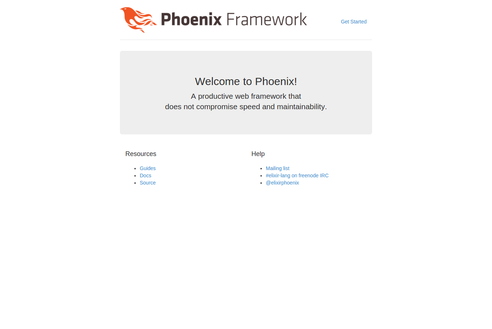

% Phoenix Framework
% Ruby舞鶴
% November 23 2015

# Who am I?

## Who am I?

- 近藤 茂 (twitter: @subcigel, github: cncgl)
- フリーエンジニア
- 主にバックエンドとフロントエンド
- 10年ぐらいのブランクがある(ほぼ新人)

# About

## Phoenix Framework とは

- Elixir による Web Application Framework
- 作者が Rails コミッターであり、Ruby on Rails ライクなつくり
- Erlang VM 上で動き、高速且つ堅牢


# インストール

## Elixir のインストール

- OSX

```
$ brew install elixir
```

- Ubuntu

```
$ sudo apt-get install elixir
```

## Phoenix のインストール

```
$ mix local.hex
$ mix archive.install https://github.com/phoenixframework/phoenix/releases/download/v1.0.3/phoenix_new-1.0.3.ez
```


## PostgreSQL のインストール

```
$ sudo apt-get install PostgreSQL
$ sudo passwd PostgreSQL
新しい UNIX パスワードを入力してください: postgres
新しい UNIX パスワードを再入力してください: postgres
passwd: パスワードは正しく更新されました
$ sudo -u postgres psql
psql (9.4.5)
Type "help" for help.

postgres=# alter user postgres PASSWORD 'postgres';
ALTER ROLE
postgres=# \q
```

## inotify のインストール

```
$ sudo apt-get install inotify-tools
```

ファイルを監視して変更があればリロードします。

## Node.js のインストール

- nvm でインストールします。 (Mac はnodebrew からインストールする方法もあるが共通の手順でできるため)

```
$ git clone git://github.com/creationix/nvm.git ~/.nvm
```
- ログインシェルに追加する。

```bash
[[ -s "$HOME/.nvm/nvm.sh" ]] && source "$HOME/.nvm/nvm.sh"
```
- 最新版の node.js を取得する。

```
$ nvm ls-remote
$ nvm install v5.1.0
$ nvm use v5.1.0
```

## Phoenix プロジェクト生成

```
$ mix phoenix.new hello_phoenix
$ cd hello_phoenix
$ mix ecto.create
$ npm i
$ mix phoenix.server
```
http://localhost:4000/ にアクセス



## Build

- In the root folder you have to execute:

~~~
./build.sh [mode] [folder]
~~~

- Where [**mode**] can take the next values:

    - "**min**": generate deck-slides and plain html.
    - "**med**": generate also reveal-slides, docx and odt (**default value**)
    - "**max**": generate all formats.

- And where [**folder**] is the name of the folder wher to find
  the md files. If no folder name, it will convert all md files of all the folders.

# Author

## Adolfo Sanz De Diego

- **Old JEE web developer**

- Today:

    - **Computer teacher**:

        - Hardware, Operating Systems
        - Networking, Programming

    - **Freelance Trainer**:

        - Java, Android
        - JavaScript, jQuery
        - JSF, Spring, Hibernate
        - Groovy & Grails

    - **I like to develop**

### Hackalover


- **For hackathons lovers**

    - **Meetup**: [http://www.meetup.com/Hackathon-Lovers/](http://www.meetup.com/Hackathon-Lovers/)
    - **Twitter**: [http://twitter.com/HackathonLovers](http://twitter.com/HackathonLovers)
    - **Blog**: [http://hackathonlovers.tumblr.com/](http://hackathonlovers.tumblr.com/)
    - **LinkedIn**: [http://www.linkedin.com/groups/Hackathon-Lovers-6510465](http://www.linkedin.com/groups/Hackathon-Lovers-6510465)
    - **YouTube**: [http://www.youtube.com/channel/UCRwSe7jK-y62BMvIiNBV1qw](http://www.youtube.com/channel/UCRwSe7jK-y62BMvIiNBV1qw)

### Tweets Sentiment


- Is a **tweets analyzer** which extracts semantic information to know
if the general tweets feeling about a topic is positive or negative.

    - **Web**: [http://tweetssentiment.com/](http://tweetssentiment.com/)
    - **Twitter**: [http://twitter.com/TweetsSentiment](http://twitter.com/TweetsSentiment)

### Where to find me?

- My nick: **asanzdiego**

    - AboutMe:  [http://about.me/asanzdiego](http://about.me/asanzdiego)
    - GitHub:   [http://github.com/asanzdiego](http://github.com/asanzdiego)
    - Twitter:  [http://twitter.com/asanzdiego](http://twitter.com/asanzdiego)
    - Blog:     [http://asanzdiego.blogspot.com.es](http://asanzdiego.blogspot.com.es)
    - LinkedIn: [http://www.linkedin.com/in/asanzdiego](http://www.linkedin.com/in/asanzdiego)
    - Google+:  [http://plus.google.com/+AdolfoSanzDeDiego](http://plus.google.com/+AdolfoSanzDeDiego)
